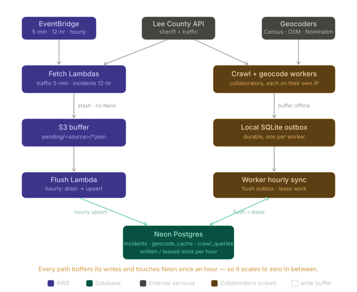

# Lee County Sheriff Activity — Data Pipeline

The data-collection backend for an interactive map of public-safety activity in Lee County, FL. It continuously collects, normalizes, geocodes, and archives public Computer-Aided Dispatch (CAD) records from the Lee County Sheriff's Office into a clean, queryable history. This is the ingestion layer of a UCF Senior Design project; the map, heatmaps, and clustering build on top of it.

## What it does

Two stages, decoupled so the slow, rate-limited geocoders never block collection — both idempotent and resumable:

- **Harvest** — fetch CAD records, normalize each into one canonical schema, and upsert (dedup on `(source, source_incident_id)`; coordinates left null).
- **Geocode** — a separate pass resolves the still-uncoordinated addresses through a three-tier fallback chain with a persistent cache, backfilling coordinates in place.

Data enters two ways, both writing to the same `incidents` table so live and historical records merge into one set:

- **Live feeds** (cloud) — *sheriff incidents* (general CAD, every 12 h) and *traffic crashes* (only the 5 most-recent active calls, fetched every 5 min so none roll off unseen).
- **Bulk crawl** (collaborators) — reconstructs ~2.5 years of history the live API can't paginate to, by exploiting its substring address filter. See [Bulk historical extraction](#bulk-historical-extraction).

## Architecture



A small reusable **engine** with **two apps** on top. Everything is built around swappable interfaces, so adding a source, geocoder, or storage backend never touches unrelated code.

- **Adapters** (`adapters/`) — one file per source implementing `fetch_raw()` + `normalize()`. Adding a county is a new file plus a registry line.
- **Canonical model** (`models.py`) — every adapter emits a `NormalizedIncident`; the full original payload is kept in `raw`.
- **Geocoding** (`geocoding/`) — three geocoders chained behind one interface, first hit wins:
  1. **Census** — fast, parallel; standard street addresses (`535 PINE ISLAND RD`).
  2. **Overpass / OpenStreetMap** — resolves *intersections* (`CLAYTON AVE / LEELAND HEIGHTS BLVD E`) by finding the OSM node the two named roads share; rotates three endpoints with per-endpoint cooldowns.
  3. **Nominatim** — fuzzy last resort.

  A persistent **cache** keyed on the normalized address means each location is geocoded once, ever.
- **Storage** (`store/`) — one `IncidentStore` interface, `SqliteStore` (local) and `PostgresStore` (Neon). The upsert dedups the batch, **skips no-op writes**, and applies a **recency guard** so a delayed or replayed batch can't overwrite a newer status — newest data wins, not last writer.

### Batched writes — keeping Neon asleep

Neon (serverless Postgres) scales to zero when idle, so the system is designed to **touch it only about once an hour**. Every producer buffers its writes in a durable store and flushes on a schedule, instead of writing on every fetch:

- **Live feeds** — the fetch Lambdas write nothing to Neon; they stash each fetch's normalized records as JSON in an **S3 buffer**. A separate **flush Lambda** runs hourly, drains S3, and upserts in one batch.
- **Crawl + geocode workers** — each accumulates results in a **local SQLite outbox** and opens one Neon session per hour to flush the outbox *and* lease the next hour's work; the rest of the hour it runs fully offline (Lee County API + geocoders only).

Because every write is an idempotent upsert on a stable key, a crash or a duplicated/late flush is harmless — it re-applies near-no-ops, and the recency guard blocks any stale overwrite. (`sync/` holds the workers' outbox + flush; `pipeline/s3_buffer.py` + `pipeline/flush.py` are the S3 equivalent.)

## Project structure

```
src/leecad/           the engine package
  adapters/           data sources (IncidentSource: fetch_raw + normalize)
  geocoding/          three-tier geocoder chain + persistent cache
  store/              IncidentStore: SqliteStore (local) / PostgresStore (Neon)
  sync/               worker outbox + hourly flush/lease (outbox · flush · schedule · geocode_worker)
  pipeline/           live feeds: fetch → S3 (fetch_handler), hourly S3 → Neon (flush_handler)
  crawl/              bulk crawl: crawl_queries coordinator + harvest worker
  ingest.py           engine wiring (build_store / build_geocoding / geocode_pending)
  models.py           NormalizedIncident canonical schema
  cli.py              the `leecad` CLI (harvest | backfill | smoke | flush-s3 | crawl …)
infra/                deployment: Lambda build + entry shim, systemd units, AWS inventory
tests/                fixture-based tests (pytest)
data/seeds/           committed crawl seed (~13k street queries)
```

Runtime SQLite DBs and worker outboxes live under `data/` (git-ignored); the crawl seed is committed at `data/seeds/street_queries.txt`.

## Running locally

Requires [uv](https://github.com/astral-sh/uv) and Python 3.12+. With `DATABASE_URL` unset everything uses a local SQLite DB under `data/`; set it to a Postgres connection string to use Neon instead.

PostgreSQL schema changes are owned by Alembic under `../database`. The pipeline
checks that its required tables exist but doesn't create or alter PostgreSQL
objects at startup. Apply the database migrations before pointing the pipeline
at a new PostgreSQL database.

```bash
uv sync

# Harvest one feed (fetch + normalize + upsert)
uv run leecad harvest lee_county
uv run leecad harvest lee_county_traffic

# Geocode whatever still lacks coordinates
uv run leecad backfill 150

uv run pytest
```

## Bulk historical extraction

The live API exposes only the ~1,000 most-recent records with no pagination, so deep history is unreachable normally. The crawl recovers it via the API's one filter — `address`, a literal **substring** match.

**Strategy.** US addresses are `<house#> <street> <suffix>`. Since the match is a substring, `address=0 PALM BEACH BLVD` matches only house numbers ending in `0` (the space is literal). The ten queries `0 …` – `9 PALM BEACH BLVD` disjointly partition the street, and the split recurses: a query that still hits the 1,000-record cap fans out into ten children (`00 …`, `10 …`, …). Seeded from ~13,000 street names and recursing only where needed, this reconstructs the full history.

**Coordination.** A `crawl_queries` table on Neon is the shared work queue. Each collaborator runs a worker on their own IP that, once an hour, opens a single Neon session to flush the prior hour's results (from its local outbox) and claim a batch of queries (`FOR UPDATE SKIP LOCKED`) — then spends the hour fetching (paced to the per-IP limit) and geocoding offline. A truncated (1,000-record) result fans out ten children; the claim is **self-healing** — it reclaims queries an absent worker left in-progress once their lease expires, so no separate reaper is needed.

**Rate discipline.** The binding limit is ~50 requests/IP/12 h, so a worker fetches ~4/hour (one per ~15 min). Throughput scales by adding collaborators, not by going faster; a full crawl is a multi-week effort.

**Running it** (`DATABASE_URL` = the shared Neon string):

```bash
# Once, by whoever seeds the queue (seed list is committed at data/seeds/):
uv run leecad crawl init                    # verifies migrated schema + seeds the full street list

# Each collaborator, on their own machine/IP — both sync to Neon hourly:
uv run leecad crawl work    <worker_id>     # harvest
uv run leecad crawl geocode <worker_id>     # geocode

uv run leecad crawl test    <worker_id>     # quick 2-tick smoke against the real API
```

## Deployment

The live pipeline is serverless on AWS; a Neon (serverless Postgres) database holds `incidents`, `geocode_cache`, and `crawl_queries`.

- **Fetch Lambda** (`lambda_function.fetch_handler`) — one function, invoked by two EventBridge Scheduler schedules (`{"source": "lee_county_traffic"}` every 5 min; `{"source": "lee_county"}` every 12 h). It fetches, normalizes, and writes to S3 — no Neon.
- **Flush Lambda** (`lambda_function.flush_handler`) — EventBridge Scheduler, hourly; drains the S3 buffer into Neon in one upsert.
- **Env / IAM** — `S3_BUFFER_BUCKET` on both; `DATABASE_URL` on the flush function. Fetch needs `s3:PutObject`; flush needs `s3:ListBucket` / `GetObject` / `DeleteObject` plus Neon. (`boto3` is provided by the Lambda runtime.)

Build the deployment zip (Linux-targeted wheels from `uv.lock`, so `psycopg` / `pydantic-core` match Lambda's runtime):

```bash
./infra/lambda/build.sh    # -> build/lambda.zip
```

One artifact serves both functions; `infra/README.md` has the full AWS inventory plus deploy and rollback recipes, and `infra/systemd/` holds the worker units.

## Data model

`incidents`, keyed on `(source, source_incident_id)`:

| Field | Notes |
|---|---|
| `source`, `source_incident_id` | Feed + the source's own ID (primary key) |
| `occurred_at` | When the incident happened (UTC) |
| `fetched_at` | When first fetched (UTC); frozen on later updates ≈ first-seen |
| `last_changed` | When `status` / `disposition` last changed (UTC); drives the recency guard |
| `lat`, `lon` | Coordinates (null until geocoded) |
| `nature`, `disposition` | Call type / outcome |
| `address`, `city` | Reported location |
| `status` | Live dispatch status, e.g. `ASSIGNED`, `ARRIVED` (traffic feed) |
| `geocoded_at`, `geocode_quality` | When, and by which geocoder, coordinates were derived |
| `geocode_attempts`, `geocode_locked_by`, `geocode_locked_at` | Retry counter (stops after 3) + per-row geocode lease (reclaimable after 2 h) |
| `raw` | The complete original payload |

## Data sources & principles

All data comes exclusively from **official public APIs** — the Sheriff's public incidents and active-traffic-calls endpoints. No scraping of non-API sources: a deliberate constraint that keeps the project on firm ethical and legal footing and reflects the broader goal of encouraging agencies to publish open data. The bulk crawl uses the same public API, self-rate-limited below the published caps. All of it is public record under Florida's Sunshine Laws (Chapter 119). Lee County is currently the only FL county with a suitable public API; the adapter architecture makes adding others trivial **if and when** they publish one.

## Known limitations

- A small, roughly constant set of addresses (highway mile markers, corrupted CAD entries, named landmarks) resolves with no free geocoder and is stored without coordinates — an inherent ceiling, not a defect; coverage sits in the mid-90% range.
- Records with a missing or ambiguous `city` whose street name also exists elsewhere in Florida (e.g. a `PALM BEACH BLVD` on both coasts) can geocode to the wrong place; these are filtered against the Lee County bounding box during downstream cleaning.
- The crawl's digit-partition recovers numbered addresses; intersections and other non-numbered records beyond a truncated street's most-recent 1,000 aren't recovered (intersections are rare in the incident feed — they dominate the separate traffic feed).
- The ~50-request/IP/12 h ceiling is an empirical estimate — watch for `429`s during the first sustained run.

## Acknowledgments

Geocoding is powered by the [U.S. Census Geocoder](https://geocoding.geo.census.gov/), [OpenStreetMap](https://www.openstreetmap.org/) via the [Overpass API](https://overpass-api.de/), and [Nominatim](https://nominatim.org/). Built as part of a Senior Design capstone at the University of Central Florida.

## License

[MIT](LICENSE)
