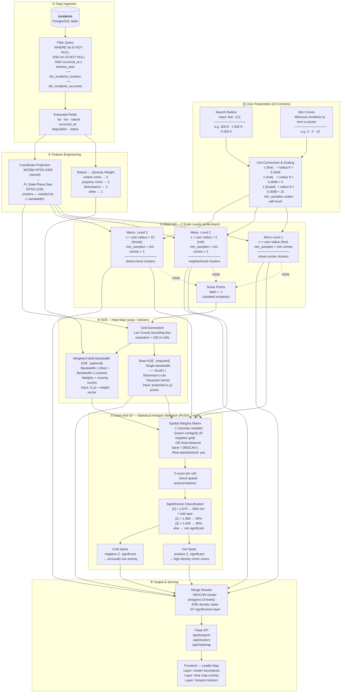
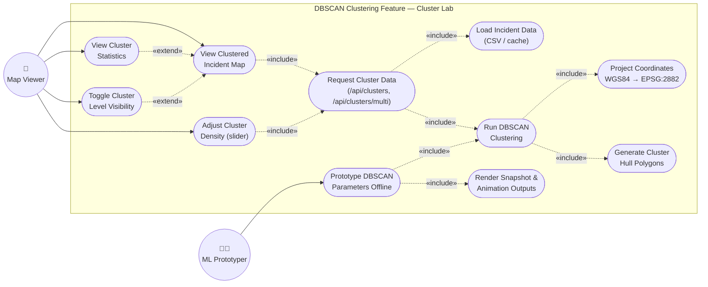

## DBSCAN Feature — Use Case Diagram

Mermaid has no native UML use-case shape, so actors are drawn as stick-figure nodes and use cases as stadium-shaped nodes inside the system boundary. `<<include>>` edges are mandatory sub-steps; `<<extend>>` edges are optional/conditional behavior.



**Actors**
- **Map Viewer** — end user of the [cluster-lab.html](../frontend/cluster-lab.html) page; toggles the district/neighborhood/street layers and drags the sparse↔dense sliders.
- **ML Prototyper** — developer running [dbscan_demo.py](../backend/ml/dbscan_demo.py) offline to tune `EPS`/`MIN_SAMPLES` before wiring new behavior into the live feature.

**Use cases**
- *View Clustered Incident Map* / *Toggle Cluster Level Visibility* / *Adjust Cluster Density* / *View Cluster Statistics* — client-side interactions in [cluster-lab.html](../frontend/cluster-lab.html).
- *Request Cluster Data* — Flask routes `/api/clusters` and `/api/clusters/multi` in [app.py](../backend/app.py).
- *Load Incident Data*, *Run DBSCAN Clustering*, *Project Coordinates*, *Generate Cluster Hull Polygons* — served by `load_csv_incidents()` / `run_clusters()` in [clustering.py](../backend/ml/clustering.py).
- *Prototype DBSCAN Parameters Offline* / *Render Snapshot & Animation Outputs* — standalone exploration in [dbscan_demo.py](../backend/ml/dbscan_demo.py), decoupled from the live API.
```