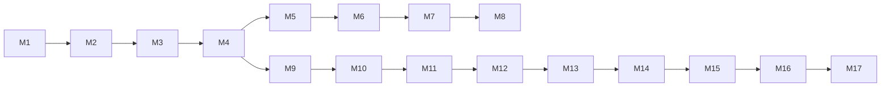

# Clustering Feature — Milestone Chart

Two parallel tracks: **DBSCAN Live Integration** and **Timeframe Animation**.  
Baseline date: 2026-07-14 (sprint week 1).

---

## Milestone Table

| Track | # | Milestone | Depends On |
|-------|---|-----------|------------|
| A — DBSCAN | M1 | Refactor demo → production module | — |
| A — DBSCAN | M2 | Multi-scale clustering (micro / meso / macro) | M1 |
| A — DBSCAN | M3 | Cluster GeoJSON serialization | M2 |
| A — DBSCAN | M4 | Clusters API endpoint | M3 |
| A — DBSCAN | M5 | Cluster result caching | M4 |
| A — DBSCAN | M6 | Frontend — cluster polygon layer | M5 |
| A — DBSCAN | M7 | Frontend — scale toggle + cluster popup | M6 |
| A — DBSCAN | M8 | Integration QA + deployment | M7 |
| B — Animation | M9 | Time-bucket query + API contract | M4 |
| B — Animation | M10 | Clusters timeline API endpoint | M9 |
| B — Animation | M11 | Frontend — timeline slider + date range | M10 |
| B — Animation | M12 | Frontend — playback engine | M11 |
| B — Animation | M13 | Frame renderer — DBSCAN cluster swap | M12 |
| B — Animation | M14 | Cluster birth/death visual transitions | M13 |
| B — Animation | M15 | Playback speed control + frame counter HUD | M14 |
| B — Animation | M16 | Animation QA + performance tuning | M15 |
| B — Animation | M17 | Export animation (GIF / video) | M16 |

---

## Dependency Graph

